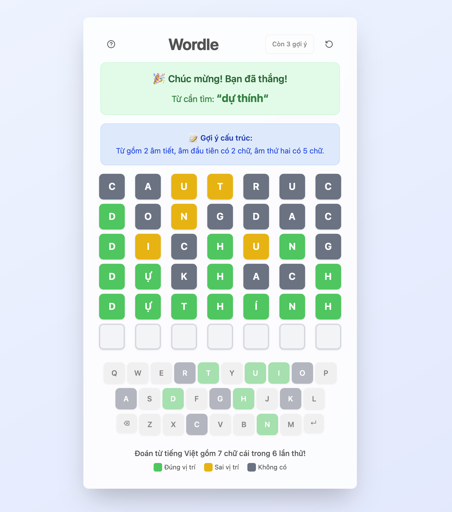

**Wordle Tiếng Việt** là trò chơi đoán từ dựa trên cảm hứng từ Wordle, dành riêng cho người dùng tiếng Việt. Bạn có 6 lượt để đoán một từ tiếng Việt gồm 7 chữ cái (không dấu, không khoảng trắng). Sau mỗi lần đoán, các ô chữ sẽ đổi màu để gợi ý mức độ chính xác của bạn:

- 🟩 **Xanh lá**: Chữ đúng và đúng vị trí.
- 🟨 **Vàng**: Chữ đúng nhưng sai vị trí.
- ⬜ **Xám**: Chữ không có trong từ.

## Cách chơi

1. Mỗi lượt, nhập một từ tiếng Việt hợp lệ gồm 7 chữ cái (không dấu, không khoảng trắng).
2. Nhấn **Enter** để xác nhận.
3. Quan sát màu sắc các ô để suy luận từ cần tìm.
4. Bạn có tối đa 6 lượt đoán. Có thể sử dụng tối đa 3 gợi ý để biết một chữ cái có trong từ.
5. Khi hết lượt hoặc đoán đúng, từ cần tìm sẽ được hiển thị.

## Cách chương trình hoạt động

- **Chọn từ ngẫu nhiên:** Mỗi ván chơi, chương trình chọn một từ tiếng Việt 7 chữ cái từ danh sách trong [`lib/wordle.js`](lib/wordle.js).
- **Xử lý nhập liệu:** Người chơi nhập từ qua bàn phím thật hoặc bàn phím ảo trên giao diện.
- **So sánh & đánh giá:** Hàm kiểm tra sẽ so sánh từng chữ cái với đáp án, trả về trạng thái `correct`, `present`, hoặc `absent` cho từng vị trí.
- **Gợi ý:** Người chơi có thể nhấn nút "Gợi ý" tối đa 3 lần để biết một chữ cái có trong đáp án nhưng chưa đoán ra.
- **Giao diện:** Xây dựng bằng [Next.js](https://nextjs.org) và [React](https://react.dev), sử dụng Tailwind CSS cho giao diện hiện đại, hỗ trợ cả chế độ sáng/tối.

## Demo
Bạn có thể chơi thử tại [https://minhqnd.com/wordle](https://minhqnd.com/wordle).



## Cài đặt & chạy ứng dụng

### Yêu cầu
- Node.js >= 18
- pnpm (hoặc npm/yarn/bun)

### Cài đặt

```bash
git clone https://github.com/minhqnd/wordle-vietnamese.git
cd wordle-vietnamese
pnpm install
# hoặc npm install, yarn install, hoặc bun install
```

### Chạy ứng dụng

```bash
pnpm dev
# hoặc npm run dev, yarn dev, hoặc bun dev
```

Mở [http://localhost:3000](http://localhost:3000) trong trình duyệt để xem kết quả.

